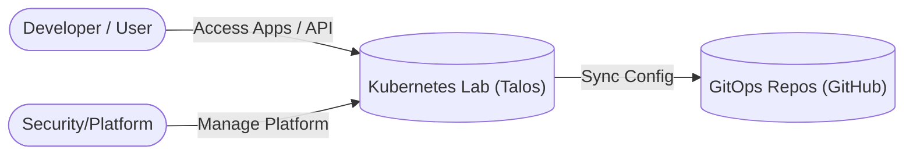
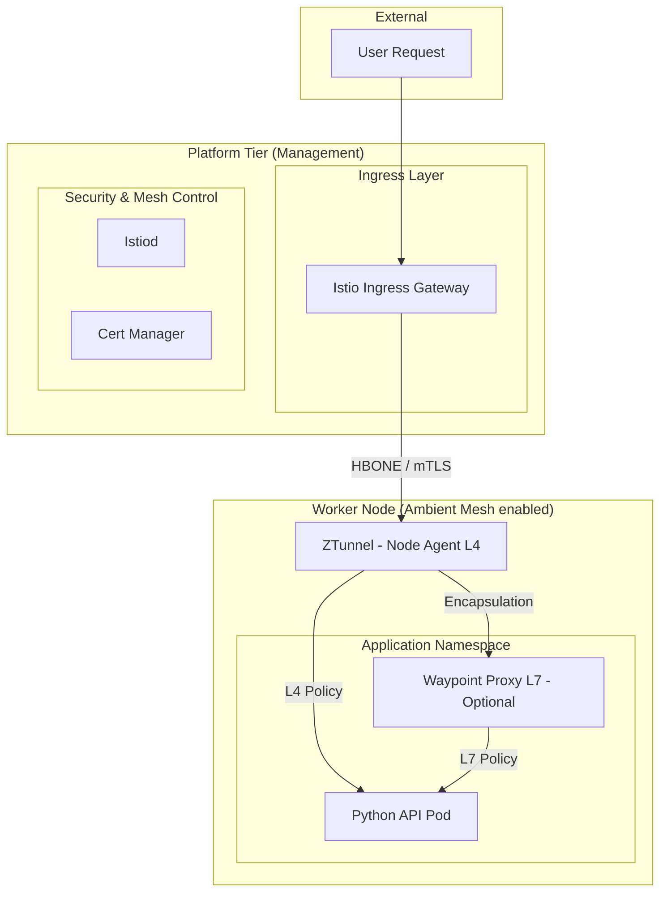
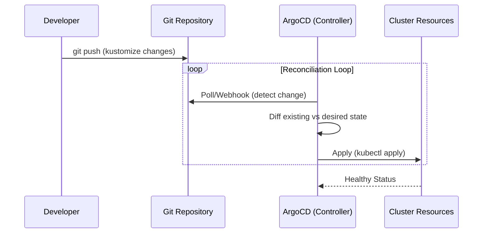

# Architecture Overview: K8s Lab Design

This document describes the design philosophy, technical flows, and component objectives for the Kubernetes Lab using a C4-inspired modeling approach.

## 1. System Context (C4 Level 1)
The Lab System provides a platform for deploying and managing containerized applications using GitOps.

## 2. Platform Containers & Traffic Flow (C4 Level 2)

This diagram visualizes how an external request enters the cluster and interacts with the internal tiers using **Istio Ambient Mesh** (Sidecarless).

### Request Traffic Flow (Ambient Mesh Lifecycle)
1.  **Entry**: Traffic hits the **Istio Ingress Gateway**.
2.  **L4 Security (ztunnel)**: The Gateway sends traffic via **HBONE** (HTTP-Based Overlay Network) to the destination node's **ztunnel**. This provides node-to-node mTLS without sidecars.
3.  **L7 Processing (Waypoint)**: If complex L7 policies (retries, headers) are needed, traffic is routed through a **Waypoint Proxy** (a dedicated pod for the namespace).
4.  **Delivery**: The request is delivered to the **Python API** pod. No sidecar container is running inside the application pod.

## 3. GitOps Lifecycle (The "Deployment" Flow)

We follow a **Push-to-Git, Pull-to-Cluster** strategy.

## 4. Namespace Strategy

| Category | Pattern | Purpose |
| :--- | :--- | :--- |
| **System** | `kube-*`, `talos-*` | Core Kubernetes/OS components. |
| **Platform** | `istio-system`, `argocd` | Shared platform tools. |
| **Environment** | `<env>-<app-name>` | Business apps. **Labeled for Ambient Mesh** (`istio.io/dataplane-mode=ambient`). |

## 5. Component Objectives & Finality

| Component | Responsibility | Failure Impact |
| :--- | :--- | :--- |
| **Talos OS** | Immutable Node Security. | Total Failure. |
| **ArgoCD** | GitOps Reconciliation. | Management drift. |
| **Istio Ambient** | **Sidecarless** L4/L7 Service Mesh. | Loss of mesh connectivity / ZT security. |
| **ZTunnel** | Node-level mTLS (L4). | Loss of L4 connectivity on the node. |
| **Cert-Manager** | Identity & TLS certificates. | Expired identities; mTLS handshake failures. |

## 6. Connectivity Strategy: Professional Exposure

Moving away from the "NodePort approach" common in basic labs, this architecture uses the **Gateway API** standard via Istio.

| Feature | Basic Lab (NodePort) | This Lab (Istio Gateway) |
| :--- | :--- | :--- |
| **Port Management** | Manual (30000-32767) | Standard ports (80/443) |
| **Security** | Direct exposure to nodes | Protected by Ztunnel (mTLS) |
| **Layer 7** | No routing logic | Header-based routing, retries, etc. |
| **TLS** | Manual / None | Automatic with Cert-Manager |

## 7. Node Isolation Rationale (Tiering)

To maximize the 4GB server capacity, we use a physical-to-logical separation:

*   **Platform Workers**: Dedicated to "heavy" clusters-wide services (ArgoCD, Monitoring, Istio). These are tainted to ensure business workloads do not steal resources from the management plane.
*   **Application Workers**: Optimized for user workloads. By keeping these separate, we can update or scale applications without risking the stability of the ArgoCD sync loop or the Istio Control Plane.
*   **Node Selection Enforcement**: All platform deployments (e.g., ArgoCD) are patched via GitOps to include a `nodeSelector` for the `platform` tier, ensuring strict adherence to this isolation strategy.
