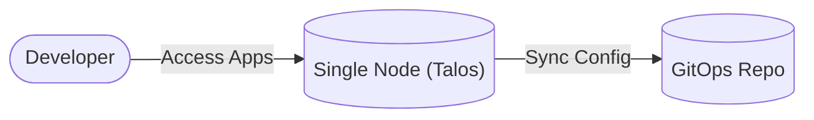

# Architecture Overview: Single-Node K8s Lab Design

This document describes the design for a resource-efficient Kubernetes Lab running on a **single physical node** using Talos Linux and Istio Ambient Mesh.

## 1. System Context
The system provides a platform for GitOps-driven application deployment on a single consolidated node.

## 2. Namespace Strategy (Logical Isolation)
Because we have a single physical node, isolation is enforced through a strict namespace strategy and Istio Ambient Mesh policies.

| Category | Patterns | Purpose | Mesh Status |
| :--- | :--- | :--- | :--- |
| **System** | `kube-*`, `talos-*` | Core Kubernetes/OS components. | Excluded |
| **Platform** | `istio-system`, `argocd` | Shared platform tools (ArgoCD, Gateways). | Selective |
| **Workloads** | `<env>-<app-name>` | Business/User applications. | **Ambient Enabled** |

### Policy Enforcement
*   **Labeling**: Workload namespaces MUST be labeled with `istio.io/dataplane-mode=ambient` to join the sidecarless mesh.
*   **Resource Management**: Logical limits are used to ensure platform tools (ArgoCD) always have enough memory to operate in the shared 4GB environment.
*   **Logical Tiers**: Even on one node, we preserve the "Tier" concept in labels (e.g., `app.kubernetes.io/part-of=platform`) to maintain GitOps compatibility with cloud-scale designs.

## 3. Traffic Flow (Ambient Mesh)
We use **Istio Ambient Mesh** to minimize memory consumption by removing sidecars.

1.  **Ingress**: Traffic enters via the **Istio Ingress Gateway**.
2.  **L4 Security**: The **ztunnel** (running as a daemonset) handles mTLS encryption.
3.  **App Delivery**: Traffic goes directly to the application pod without sidecar overhead.

## 4. Resource Allocation (4GB RAM)
To survive on 4GB of RAM:
*   **Talos OS**: Minimal footprint.
*   **No Sidecars**: Ambient mesh saves ~50MB per pod.
*   **Consolidated CP**: Allowing scheduling on the control plane removes the need for extra VMs.

## 5. Component Objectives

| Component | Responsibility |
| :--- | :--- |
| **Talos OS** | Immutable OS and single-node K8s management. |
| **ArgoCD** | GitOps reconciliation for all tiers. |
| **Istio Ambient** | Sidecarless mTLS and routing. |
| **Namespaces** | Logical isolation of workloads. |

## 6. Connectivity
Services are exposed via the **Gateway API** standard. The single node's IP (`192.168.1.35`) serves as the entry point for all HTTP/HTTPS traffic on ports 80/443.
